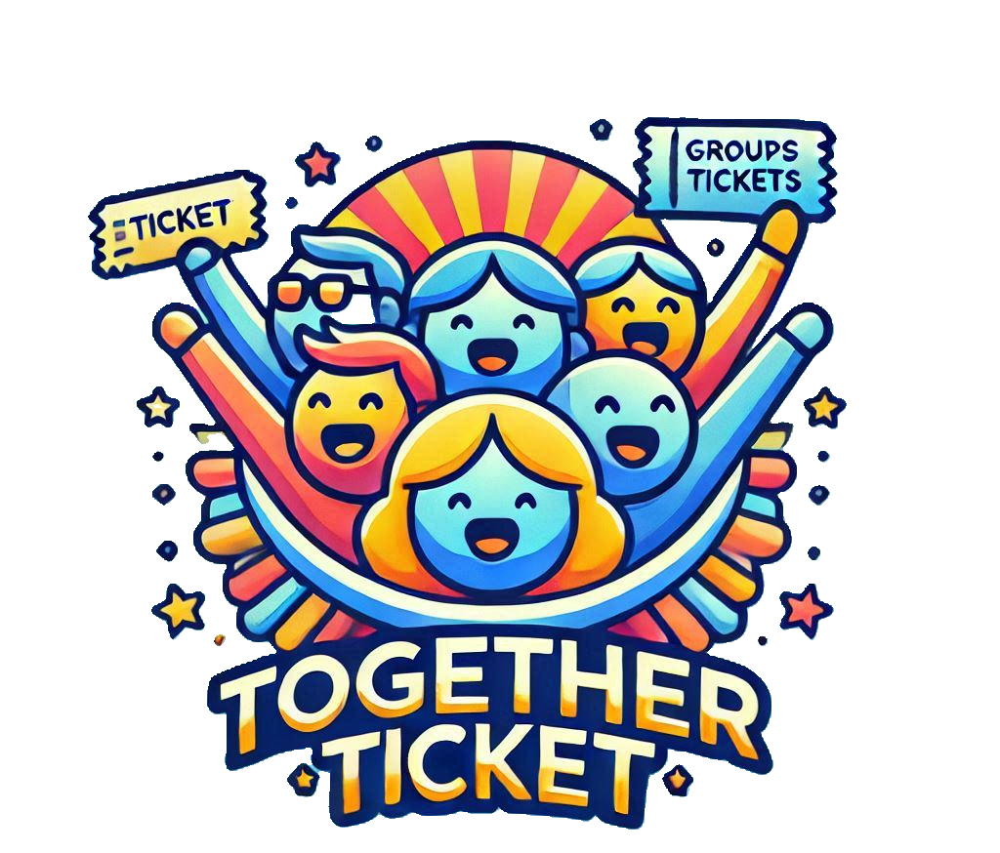

<div style="display: flex; align-items: center;">
  
  <h1 style="font-size: 36px; font-weight: bold; margin: 0;">TogetherTicket</h1>
</div>

**TogetherTicket** è un'applicazione sviluppata in **Java** che consente agli utenti di accedere, visualizzare eventi, creare o unirsi a gruppi e comunicare tramite una bacheca condivisa.

---

## Tecnologie Utilizzate

  
  
  

- **Java (Swing)**: Per l'interfaccia grafica e la logica dell'app.
- **MySQL**: Per la gestione e memorizzazione dei dati (utenti, eventi, gruppi, messaggi).
- **Eclipse**: IDE utilizzato per lo sviluppo.

---

## Struttura del progetto

```
TT/
├── application/         # Entry point (MainApp.java)
├── controller/          # Gestione del flusso logico e coordinamento tra view e dao
├── dao/                 # Accesso ai dati nel database
├── database/            # Connessione al database MySQL
├── model/               # Classi modello (Utente, Evento, Gruppo, Messaggio, ecc.)
├── util/                # Utility varie (stili, validazioni, ecc.)
├── view/                # Interfaccia grafica (Swing)
├── Database/            # Script SQL per creare e popolare il database
└── README.md            # Questo file
```

---

## Requisiti

- **Java JDK 11 o superiore** (https://www.oracle.com/java/technologies/downloads/#jdk24-windows)
- **MySQL** (https://dev.mysql.com/downloads/workbench/)
- **Eclipse IDE** (o un altro IDE Java)

---

## 🧑‍💻 Avvio del progetto

### 1. Clona il repository

Nel Desktop crea una cartella, nel prompt dei comandi con il comando `cd` spostati in tale cartella, esempio `cd C:\Users\Ciao\Desktop\Progetto`. Ora clona il repository in tale cartella con il comando

```bash
git clone https://github.com/IngSW-unipv/Progetto-DA25.git
```

---

### 2. Configura il database

- Apri **MySQL Workbench**.
- Esegui **in ordine** i due script SQL che si trovano nella cartella `Database`:

  1) `CreaDatabase.sql` – crea tutte le tabelle necessarie (utenti, eventi, gruppi, bacheca, ecc.)
  2) `InsertData.sql` – inserisce dati di esempio per testare l’applicazione.

---

### 3. Importa il progetto in Eclipse

- Apri Eclipse.
- Vai su `File > Import > General > Projects from Folder or Archive`.
- Seleziona la cartella del progetto `TT` che hai clonato.

---

### 4. Configura la password di MySQL

- Apri il file `DatabaseConnection.java` nel pacchetto `database`.
- Sostituisci il valore della password con quella del tuo utente MySQL:

```java
private static final String PASSWORD = "la_tua_password_mysql";
```

---

### 5. Avvia l'applicazione

- Esegui la classe `MainApp.java` nel pacchetto `application`.
- Se la connessione al database è riuscita, verrà avviata la finestra di **login** (`LoginFrame`).
- Da lì potrai accedere come utente o amministratore.

---

## Come utilizzare TogetherTicket

### Login

- Vai alla pagina di **login** per accedere al sistema.
- Esempi di credenziali:
```bash
        username: fede      password: fede              username: marioRossi    password: password123
ADMIN   username: gloria    password: gloria   UTENTE   username: annaBianchi   password: securepass
        username: diane     password: diane             username: lucaVerdi     password: mypassword
```

### Visualizzazione eventi

- Dopo il login, la homepage mostrerà una lista di eventi disponibili, ciascuno con i dettagli (data, luogo, descrizione e prezzo) e, se desideri, puoi acquistare un biglietto.

### Creazione e gestione gruppi

- Ogni evento ha la possibilità di creare un gruppo dopo l'acquisto del relativo biglietto.
- In alternativa puoi unirti a un gruppo gia' esistente.

### Bacheca del gruppo

- Ogni gruppo creato ha una **bacheca** in cui i membri possono fissare dei messaggi particolarmente importanti.

